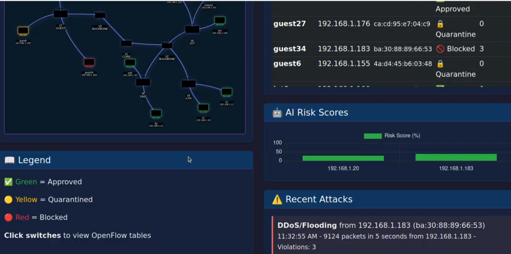
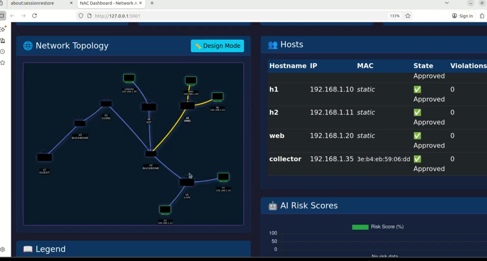
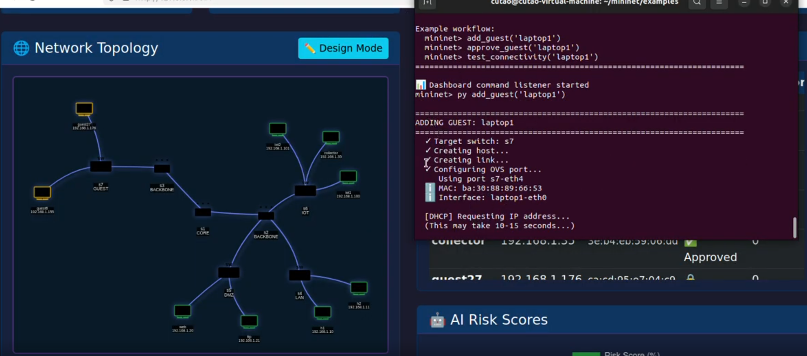
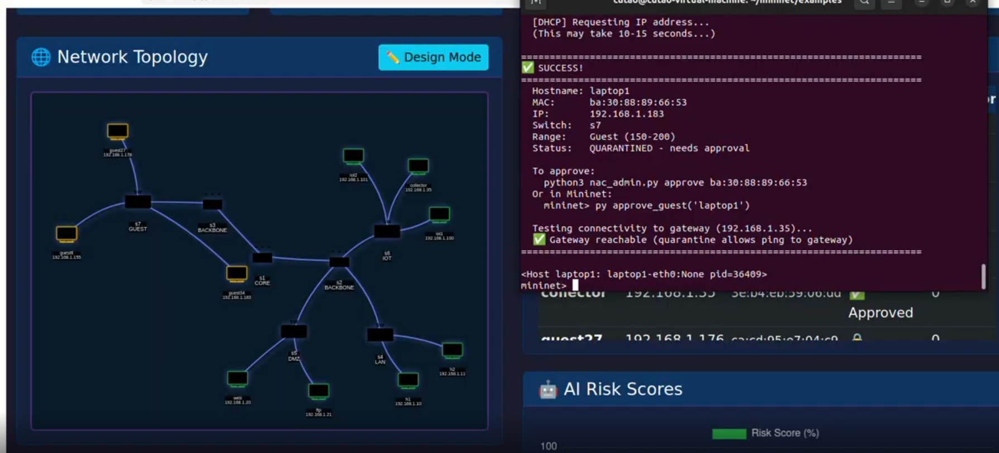
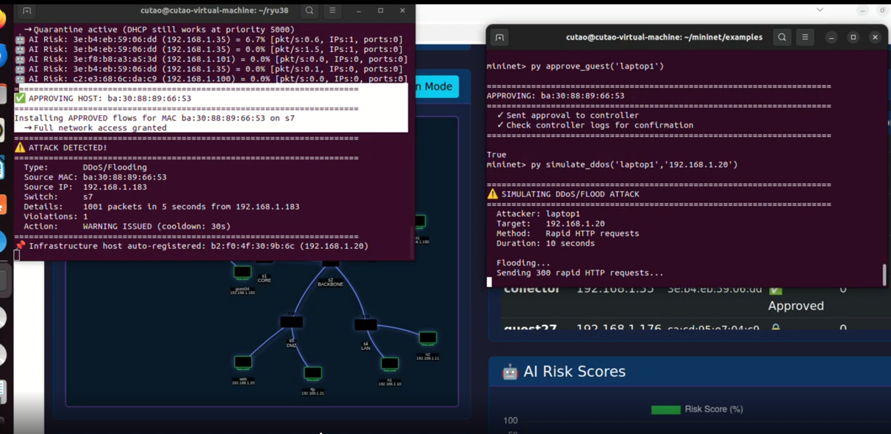
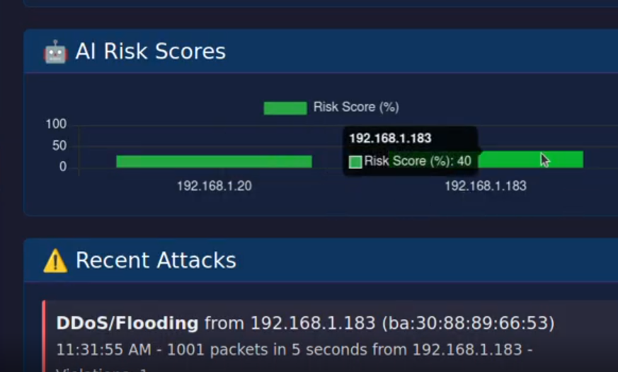
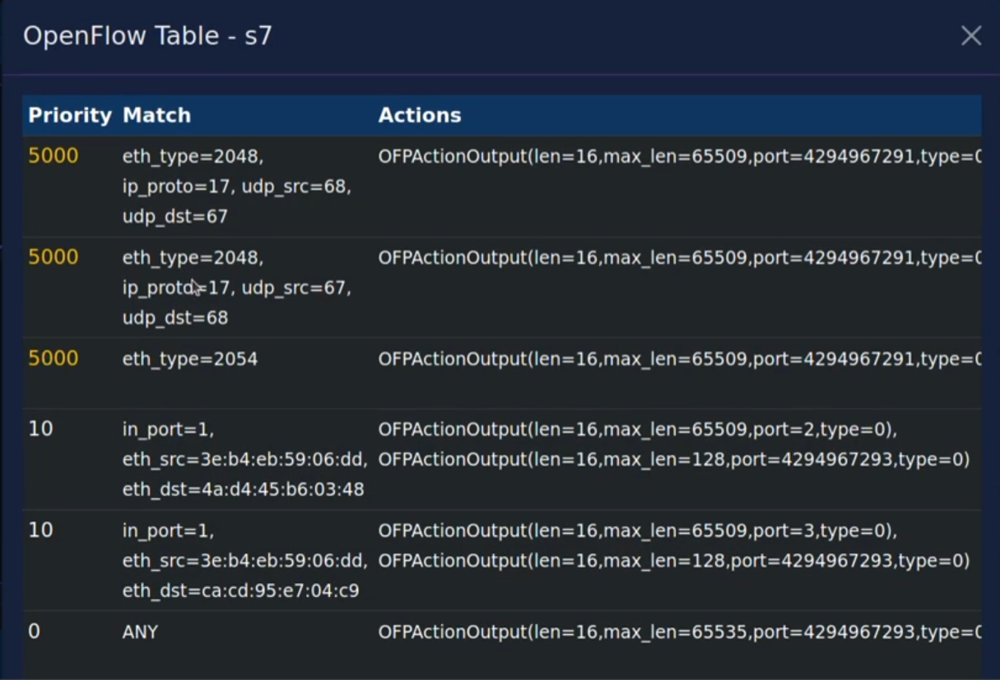
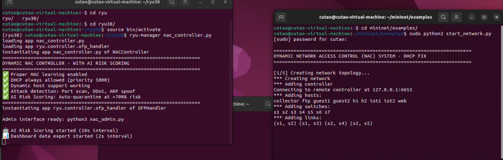

# SDN Dynamic Firewall: Network Access Control with Ryu + Mininet

A zero-trust **Network Access Control (NAC)** system built on Software-Defined Networking. Every new device that joins the network is **quarantined by default** until an admin approves it. Known IoT devices are auto-approved through DHCP, and the controller watches approved hosts for **port scans, floods and ARP spoofing**, quarantining or blocking them automatically. A live web dashboard shows the topology, host states, risk scores, attacks and the actual OpenFlow tables.

Built with **Ryu (OpenFlow 1.3)**, **Mininet / Open vSwitch**, **dnsmasq** and a **Flask-SocketIO** dashboard.


*A guest that flooded the web server was auto-blocked after 3 violations (red). Two other guests are still quarantined (yellow).*

## Network topology

7 OpenFlow switches in a hierarchical, multi-zone design:

```
                    s1 (CORE)
                   /         \
        s2 (DISTRIBUTION A)   s3 (DISTRIBUTION B)
         /       |       \            \
   s4 (LAN)  s5 (DMZ)  s6 (IoT)    s7 (GUEST)
   h1, h2    web, ftp  collector,  guest1, guest2
                       iot1, iot2
```

| Zone | Hosts | Addressing | Default state |
|---|---|---|---|
| LAN | h1, h2 | static .10, .11 | trusted infrastructure |
| DMZ | web (HTTP :80), ftp (:21) | static .20, .21 | trusted infrastructure |
| IoT | collector (DHCP server + gateway) | static .35 | trusted infrastructure |
| IoT | iot1, iot2 | DHCP, .100–.149 (MAC-tagged) | **auto-approved** |
| Guest | guest1, guest2 + any added host | DHCP, .150–.200 | **quarantined** |


*Right after launch: infrastructure hosts are approved; no traffic yet, so no risk scores.*

## Demo walkthrough

**1. A new device joins and is quarantined.** `add_guest` creates a host on the Guest switch. It gets an IP from the DHCP guest range and is quarantined; it can only ping the gateway.




**2. The admin approves it, then it attacks.** Once approved, the host gets full access, and its traffic is inspected. A simulated flood against the web server is detected immediately.



**3. Risk scores and the attack log update live.**



**4. After the 3rd violation, the host is blocked on every switch** (the red node in the image at the top).

## How it works

**Host lifecycle**

```
new device ──DHCP──▶ unapproved (quarantined) ──admin approve──▶ approved
                                                                  │
               ◀──risk > 70% (auto-quarantine)── risk scoring ────┤
                                                                  │
blocked ◀──────────3 violations (auto-block)── attack detection ──┘
```

**OpenFlow priorities used by the controller**

| Priority | Rule | Purpose |
|---|---|---|
| 6000 | `eth_src=<mac>` → drop | blocked host, on every switch |
| 5000 | DHCP (UDP 67/68) and ARP → flood | onboarding always works, even in quarantine |
| 500 | quarantined host, ICMP to gateway → allow | lets a quarantined device test reachability |
| 100 | `eth_src=<mac>` → drop | quarantine: everything else is dropped |
| 10 | L2 learned flows (idle 30 s, hard 60 s) | normal forwarding; approved hosts also send a copy to the controller for inspection |
| 0 | table-miss → controller | |


*Live flow table of s7 from the dashboard. Priority 5000: DHCP (`eth_type=2048`, UDP 68↔67) and ARP (`eth_type=2054`) flooded (`port=4294967291` = `OFPP_FLOOD`). Priority 10: learned L2 flows that forward to the destination port **and** send the first 128 bytes to the controller (`port=4294967293` = `OFPP_CONTROLLER`) for inspection. Priority 0: table-miss.*

**Attack detection** (on approved hosts)

| Attack | Rule |
|---|---|
| Port scan | > 20 distinct destination ports (TCP SYN) in 10 s |
| Flood / DDoS | > 1,000 packets in 5 s |
| ARP spoofing | an IP is claimed by a different MAC than first seen |

Each detection counts as a violation (30 s cooldown per type). **3 violations means the host is blocked on all switches.**

**Rule-based AI risk scoring (expert-system style, no ML):** every 10 s, each host gets a 0–100 score from weighted rules on packet rate, distinct destination IPs and ports, ICMP and SYN counts, and broadcast ratio. An approved host scoring above 70 is moved back to quarantine. The rules are hand-tuned and fully interpretable; no model is trained.

## Dashboard

`dashboard/dashboard_server.py` serves a live dashboard (Flask + Socket.IO, refreshed every 2 s):

- interactive topology (vis-network), colored by host state
- host table with approve and block buttons
- risk score chart and attack log
- live OpenFlow flow tables per switch (click a switch)
- buttons to add guest hosts and **simulate** port scans, floods and ARP spoofing

The controller, the Mininet helpers and the dashboard communicate through JSON files in `/tmp` (state, topology, metrics, attack log, flow tables and command files).

## Run it

Requirements: Linux (tested in an Ubuntu VM), Mininet, Open vSwitch, dnsmasq, Python 3.8 (Ryu 4.34 needs it).

```bash
pip install -r requirements.txt

# Terminal 1: controller
ryu-manager controller/nac_controller.py

# Terminal 2: network (needs root)
cd mininet && sudo python3 start_network.py
#   then, inside the Mininet CLI, load the helpers and drive the demo:
mininet> py exec(open('mininet_helpers.py').read())
mininet> py add_guest('laptop1')
mininet> py approve_guest('laptop1')
mininet> py simulate_ddos('laptop1', '192.168.1.20')
mininet> py simulate_port_scan('laptop1', '192.168.1.20')

# Terminal 3: dashboard → http://localhost:5001
cd dashboard && python3 dashboard_server.py
```



## Known limitations

- **Trust is based on IP addresses.** A host that configures a static IP of a pre-approved server (e.g. `192.168.1.10`) is treated as infrastructure. A production NAC would bind identity to 802.1X, certificates or at least a MAC–IP–port binding.
- **Inspection does not scale.** Approved hosts' flows copy every packet to the controller for analysis. That is fine in Mininet; a real deployment would use flow statistics, sFlow/IPFIX or a dedicated IDS.
- **Simple rules.** "Source port < 1024" is treated as a server reply, so a scan sent from a low source port is not counted. ARP-spoof detection trusts the first MAC seen for each IP, so DHCP re-assignments can look like spoofing.
- **State lives in `/tmp` JSON files.** It is simple and easy to debug, but not concurrent-safe.
- The controller log suggests `nac_admin.py` for approvals. Use `approve_guest()` in Mininet or the dashboard button instead.

## Ideas for next steps

- Replace the rule-based risk score with an unsupervised anomaly detector (e.g. Isolation Forest) trained on per-host flow statistics.
- Collect flow stats instead of mirroring packets, and add per-zone ACLs (e.g. Guest → DMZ :80 only).
